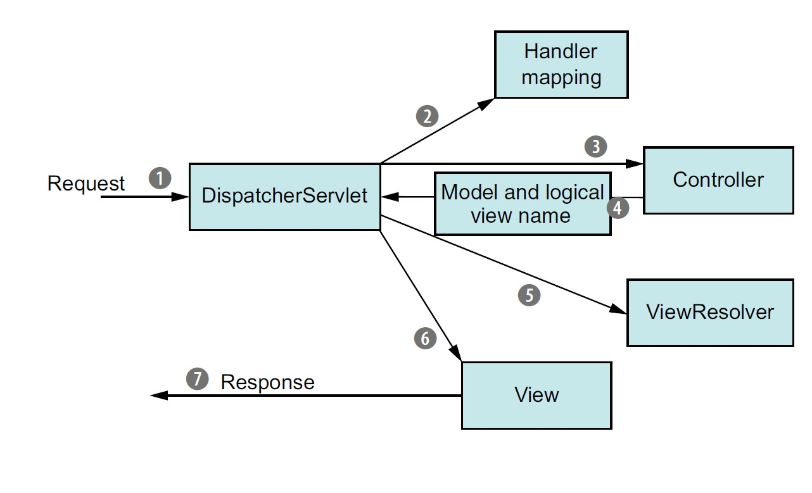

# Spring MVC和Spring BOOT比較


Spring MVC是一個WEB框架，藉由反轉控制及依賴性注入使WEB撰寫更容易維護。可用來處理URL路由、Session、模板引擎、靜態Web資源等等。

<!--，以下是簡單的流程圖：-->
<!--
-->
Spring BOOT是一個基於Spring架構的微服務，旨在自動添加各種Spring模塊到專案中，簡化各種流程。

#### 簡單的說，Spring BOOT並未提供新的功能，而是集成Spring框架和其他第三方函式庫，開發者不再需要花大量時間在配置函式庫上，更能專注在撰寫業務邏輯。

# 使用Spring Boot的優點

* 建置新專案相當容易，可直接使用Spring已部署好的專案，不需自己重新部署及設定環境
* 依賴預打包，簡化搜尋依賴的時間
* 不需使用XML
* Spring Boot CLI，可直接使用*.groovy來run
* 可使用Actuator來監控程式的狀態
* LiveReload，存檔即重啟Server並刷新Browser
## __建置新專案相當容易__
在STS中，選擇New -> Spring Starter Project可進入Spring Boot新專案生成精靈，只要依循精靈指示填入所需依賴即可生成新的Spring Boot專案。


## __Spring Boot Starter__

將常用的依賴預打包，整合成單一一個依賴，開發者可輕易添加此單一依賴完成配置!

舉例來說，如果開發者要開發新的WEB，可能要在Gradle添加以下依賴：
```
dependencies(
    compile group: 'org.springframework', name: 'spring-web', version: '4.3.8.RELEASE'
    compile group: 'org.springframework', name: 'spring-webmvc', version: '4.3.8.RELEASE'
    compile group: 'com.fasterxml.jackson.core', name: 'jackson-databind', version: '2.8.8.1'
    compile group: 'org.springframework', name: 'spring-jdbc', version: '4.3.8.RELEASE'
    compile group: 'org.springframework', name: 'spring-tx', version: '4.3.8.RELEASE'
    compile group: 'com.h2database', name: 'h2', version: '1.4.195'
    compile group: 'org.thymeleaf', name: 'thymeleaf-spring4', version: '3.0.6.RELEASE'
)
```

但如果使用Spring Boot Starter預打包，則可以簡化依賴列表：
```
dependencies(
    compile group: 'org.springframework.boot', name: 'spring-boot-starter-web', version: '1.5.3.RELEASE'
    compile group: 'org.springframework.boot', name: 'spring-boot-starter-jdbc', version: '1.5.3.RELEASE'
    compile group: 'com.h2database', name: 'h2', version: '1.4.195'
    compile group: 'org.thymeleaf', name: 'thymeleaf-spring4', version: '3.0.6.RELEASE'
)

```
可在mvnrepository.com中搜尋spring boot搜尋較常見的依賴打包

https://mvnrepository.com/search?q=spring+boot

## __不再需要使用XML__

在SpringBoot中，可使用純Java來當Controller，不再
需要部署web.xml及其他相關xml檔案。

*優點:

* 相對好閱讀及維護
* 可導航(Ctrl + Click)到目的地
* 使用Annotation簡單表示原本複雜的XML語法

## __Spring Boot CLI__

可以直接RUN *.groovy檔，程式變得很簡短!


## __Actuator__

Spring Boot Actuator為Spring Boot帶來許多有用的特性，其中最主要的是管理端點。

此功能可以幫助我們瞭解Spring Boot目前自動配置的內部情況，並列成報告的形式回報給開發者。

舉例來說，我們可以利用/autoconfig來查看專案內哪些類別是沒有被自動配置的。

使用方法:

1. 在專案中導入Spring Boot Actuator Starter

https://mvnrepository.com/artifact/org.springframework.boot/spring-boot-starter-actuator


2. 啟動專案，瀏覽器輸入:
```
http://localhost:8080/health
```

如此便可以以JSON檔來檢視此App的健康監控，如下:
```
{
"status": "UP", // UP代表運行良好，DOWN代表有問題
"diskSpace": {
"status": "UP",
"total": 509866930176,
"free": 438375424000,
"threshold": 10485760
},
"refreshScope": {
"status": "UP"
},
"hystrix": {
"status": "UP"
}
}
```

除了/health之外，還有其他的管理端點可供使用，但大部份的功能牽涉到使用者隱私，因此必須要將security關閉，步驟如下：

1. 在/src/main/resources中新建檔案application.properties

2. application.properties加入以下:
```
management.security.enabled=false
```
此指令可將管理者的security關閉，如此便可使用其他功能強大的管理端點，舉/beans為例：
```
http://localhost:8080/beans
```

輸入後可看到App運行時所有的配置的bean!

### application.properties還可以設定server.port及management.port，讓使用者和管理者分開

```
server.port: 9000 
management.port: 9001
management.address: 127.0.0.1
management.security.enabled=false
```
如此設置可讓server port由預設的8080變成9000
管理者的port則是9001
此時如果瀏覽器鍵入
```
http://localhost:9000/health
```
會顯示404錯誤，但如果鍵入管理者的port
```
http://localhost:9001/health
```
則可正常顯示!

以下是管理端點列表:(節錄自Spring4實戰一書)

* GET /autoconfig: 描述Spring Boot在使用自動配置時所做的決策
* GET /beans: 列出運行中配運的bean
* GET /configprops: 列出應用中能夠用來配置bean的所有屬性及當前的值
* GET /dump: 列出應用的執行緒
* GET /env: 列出context所有可用的環境及系統屬性變量
* GET /env/{name}: 展現某特定環境變量和屬性變量的值
* GET /health: 展現當前應用的健康狀況
* GET /info: 展現應用特定的訊息
* GET /metrics: 列出應用相關的指標，包括請求特定端點的運行次數
* GET /metrics/{name}: 列出應用特定指標的指標狀況
* POST /shutdown: 強制關閉應用
* GET /trace: 列出應用最近請求相關的元數據，含請求和回應標頭


搭配Spring Boot Admin，我們可以得到內部配置的可視化圖形。


## __LiveReload__
解決每次更改檔案都要重新啟動Server的問題，大幅提升工作效率

使用方法:引入Spring Boot DevTools

Maven中加入:
```
    <dependency>
        <groupId>org.springframework.boot</groupId>
        <artifactId>spring-boot-devtools</artifactId>
    </dependency>
```

Gradle中加入:
```
compile("org.springframework.boot:spring-boot-devtools")
```

重啟後即完成!

### 因此，我建議使用Spring Boot集成Spring MVC及其他框架。
